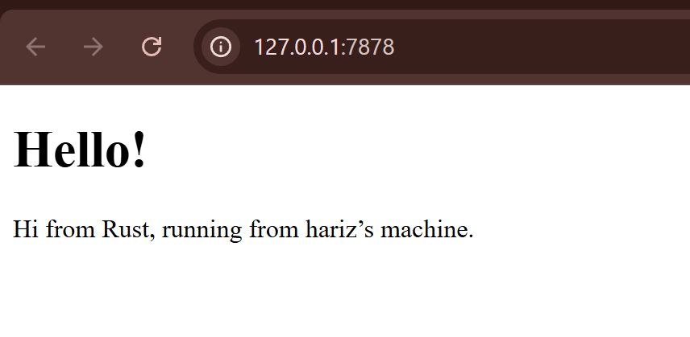

# Reflection 1: Handle-connection, Check Response
Pada milestone pertama ini, saya telah mengimplementasikan fungsi handle_connection untuk memproses koneksi TCP yang masuk ke server. 
Berikut adalah beberapa poin utama yang saya pelajari dari implementasi ini:
1. Pembacaan Request: Menggunakan BufReader untuk membaca data dari TcpStream secara efisien. Data dibaca baris demi baris menggunakan metode .lines().
2. Transformasi Data: Saya menggunakan teknik functional programming di Rust, seperti .map() untuk membuka (unwrap) hasil pembacaan dan .take_while() untuk berhenti membaca ketika menemukan baris kosong, yang menandakan akhir dari header HTTP.
3. Koleksi Hasil: Semua baris request dikumpulkan ke dalam sebuah Vec<_> menggunakan .collect() sebelum akhirnya dicetak ke konsol untuk inspeksi.
4. Struktur Request: Melalui output konsol, saya dapat melihat struktur pesan HTTP yang dikirim oleh browser, yang mencakup metode (seperti GET), path, versi protokol, serta berbagai header seperti Host, User-Agent, dan Accept.

Implementasi ini memberikan pemahaman dasar tentang bagaimana server tingkat rendah berinteraksi dengan protokol TCP sebelum kita melangkah ke pengiriman respon HTTP yang sebenarnya.

# Reflection 2
saya telah memodifikasi fungsi handle_connection agar tidak hanya mencetak request ke konsol, tetapi juga memberikan respon balik ke browser dalam bentuk file HTML. Berikut adalah beberapa poin utama yang saya pelajari:
1. Struktur Respon HTTP Agar browser dapat merender halaman dengan benar, server harus mengirimkan respon yang mengikuti format protokol HTTP. Respon tersebut terdiri dari:
 - Status Line: Berisi versi protokol dan status code (misalnya HTTP/1.1 200 OK).
 - Headers: Memberikan informasi tambahan seperti Content-Length untuk memberi tahu browser ukuran data yang dikirim.
 - Body: Isi konten yang akan ditampilkan, dalam hal ini adalah teks dari file hello.html.

2. Penggunaan Modul fs (File System)
Saya menggunakan fs::read_to_string("hello.html") untuk membaca isi file HTML dari penyimpanan lokal ke dalam variabel string di Rust. Hal ini membuat kode lebih modular karena konten visual dipisahkan dari logika program.

3. Penulisan ke Stream
Setelah format respon disusun menggunakan macro format!, data tersebut dikonversi menjadi bytes menggunakan method .as_bytes(). Kemudian, stream.write_all() digunakan untuk mengirimkan seluruh data tersebut melalui koneksi TCP kembali ke klien.

# Reflection 3: Validating Request dan Refactoring Response

Pada tahap ini, saya memodifikasi fungsi handle_connection agar server dapat memvalidasi request dan memberikan respon yang berbeda sesuai path yang diminta.

Validasi Request
Saya mengambil baris pertama dari HTTP request menggunakan .lines().next() untuk mengetahui method dan path. Jika request adalah "GET / HTTP/1.1", server mengembalikan hello.html dengan status 200 OK. Jika tidak, server mengembalikan 404.html dengan status 404 NOT FOUND.
Pemisahan Response
Dengan adanya kondisi ini, server tidak lagi mengirim response yang sama untuk semua request. Hal ini membuat server lebih realistis karena dapat memberikan feedback yang sesuai ketika halaman tidak ditemukan.
Refactoring Kode
Saya melakukan refactoring untuk mengurangi duplikasi kode pada blok if-else. Perbedaan antara kedua kondisi dipisahkan menjadi (status_line, filename), sehingga proses membaca file dan mengirim response cukup dilakukan satu kali di luar kondisi.

Refactoring ini membuat kode lebih ringkas, mudah dibaca, dan lebih mudah dikembangkan di tahap selanjutnya.

# Reflection 4: Single Thread dan Simulasi Slow Request

Pada tahap ini, saya mempelajari keterbatasan server yang berjalan secara single thread dengan mensimulasikan request yang lambat.

Simulasi Slow Request
Saya menambahkan endpoint /sleep yang menggunakan thread::sleep(Duration::from_secs(10)) sebelum mengirim response. Hal ini mensimulasikan proses yang membutuhkan waktu lama.

Dampak Single Thread
Ketika saya membuka dua browser:
Browser pertama mengakses /sleep
Browser kedua mengakses /

Saya mengamati bahwa request kedua ikut tertunda hingga request pertama selesai. Hal ini terjadi karena server hanya dapat memproses satu request dalam satu waktu.

Insight yang Didapat
Saya memahami bahwa server single thread bekerja secara sequential, sehingga satu request yang lambat dapat menghambat request lainnya. Hal ini tidak efisien dan tidak scalable jika digunakan oleh banyak user secara bersamaan.

# Reflection 5
Pada tahap ini, saya mengembangkan server dari single thread menjadi multithread menggunakan ThreadPool untuk meningkatkan performa dalam menangani banyak request.

Keterbatasan Thread per Request
Awalnya saya mencoba menggunakan thread::spawn untuk setiap request. Pendekatan ini memungkinkan beberapa request diproses secara bersamaan, tetapi memiliki kelemahan karena jumlah thread tidak terbatas dan dapat membebani sistem jika request sangat banyak.

Konsep ThreadPool
ThreadPool adalah kumpulan thread dengan jumlah tetap yang siap digunakan untuk menjalankan task. Setiap request yang masuk akan dimasukkan ke dalam antrian, lalu diambil oleh thread yang tersedia untuk diproses.